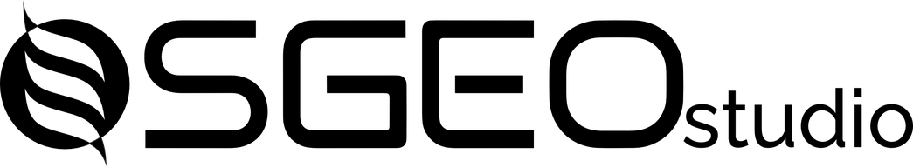

  

<h3 align="center">From core to stereonet in seconds.</h3>

  Structural drillcore logging, orientation desurveying, stereonet analysis, sections, 3D and downhole logs, in one desktop application for macOS and Windows.

  <a href="https://structuralgeologycompany.github.io/SGEOStudio/"><b>Product page</b></a> ·
  <a href="https://github.com/StructuralGeologyCompany/SGEOStudio/releases/latest"><b>Download the latest release</b></a> ·
  <a href="mailto:sales@sgeo.fi">sales@sgeo.fi</a>

---

**SGEO Studio 1.9.6** is the current release, and **2.0.0 Cataclasite**, a rewrite of the application with sections, meshes and a much faster table, is coming soon. Every installation includes a free trial of all features (seven days in 1.9.6, fourteen in 2.0), with no account and no internet connection required; the standalone stereonet stays free without limit, and after the trial a logging project opens read-only until a licence is installed.

The application runs on macOS (Apple silicon) and Windows 11 64-bit. Download the installer for your platform from the [Releases](https://github.com/StructuralGeologyCompany/SGEOStudio/releases) page. On macOS, right-click the app and choose Open the first time, since the build is not notarised.

Features, screenshots and licensing are described on the [product page](https://structuralgeologycompany.github.io/SGEOStudio/). For licences, pricing and upgrades from 1.x write to [sales@sgeo.fi](mailto:sales@sgeo.fi); for problems with the application, [studio@sgeo.fi](mailto:studio@sgeo.fi).

This repository holds the releases and the product page only; the application source is not published here.
